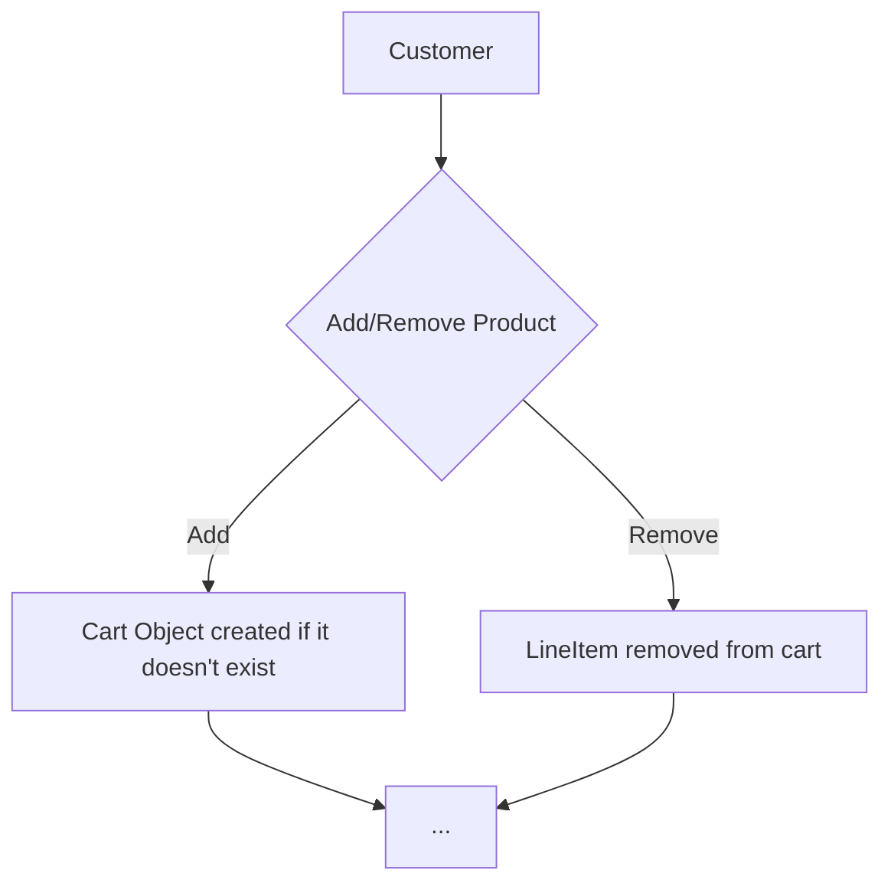
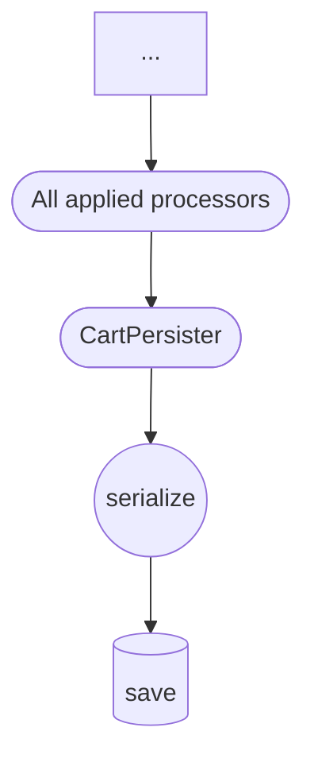

---
# try also 'default' to start simple
theme: default
background: /img/cart.jpg
# apply any windi css classes to the current slide
class: 'text-center'
# https://sli.dev/custom/highlighters.html
highlighter: shiki
# show line numbers in code blocks
lineNumbers: false
# some information about the slides, markdown enabled
info: |
  ## Journey of a cart
  Don't break the wheels
# persist drawings in exports and build
drawings:
  persist: false
---

# Journey of the Cart

Don't break the wheels

<div class="abs-br m-6 flex gap-2">
  <span class="text-sm icon-btn opacity-50 !border-none !hover:text-white">
    <carbon-logo-github />
    @r4pt0s
  </span>
</div>


---

# About me

<div class="flex justify-between align-center mr-32">

  <div class="flex flex-col gap-5">
  <div>
    <h4 >🧑‍💻 Name </h4>
    <br/>
    <span class="overline" >Wolfgang Kreminger</span>
  </div>
  <div>
    <h4>🎨 Role </h4>
    <br/>
    <span class="overline" >Fullstack Developer</span>
  </div>
  <div>
    <h4>🔨 I work for </h4>
    <br/>
    <span class="overline" > 0815 Onlinehandel GmbH</span>
  </div>
  <div>
    <h4>🤣 One job is not enough </h4>
    <br/>
    <span class="overline" > Teaching assistant at zerotomastery.io</span>
  </div>
  </div>

  <div class="flex flex-col items-center space-y-4">
    
    
    <div class="space-y-1 font-medium dark:text-white">
        <div class="text-sm text-gray-500 dark:text-gray-400 italic"> &lt;Coding&gt;4 LifeBalance&lt;/Coding&gt; </div>
    </div>
  </div>
</div>

<div v-click class="absolute bottom-100px right-80px uppercase font-bold animate-bounce text-cyan-400">
  let's jump right into it ->
</div>

<div class="abs-br m-6 flex gap-2">
  <span class="text-sm icon-btn opacity-50 !border-none !hover:text-white">
    <carbon-logo-github />
    @r4pt0s
  </span>
</div>

<!--
Talk about myself

use the list points
-->

---
clicks: 2
---

# Cart in the database


<div v-click-hide class="flex justify-center items-center pt-4 -mb-6">



</div>


<div v-click="1" class="flex justify-center items-center pt-4 -mb-6">



</div>

<div v-click="2" v-motion :intial="{ x: -80 }" :enter="{x: 0}" class="absolute top-352px left-130px">
  <span class="font-bold text-red-600">THAT ONE HURTS</span>
</div>

<arrow v-click="2" x1="300" y1="360" x2="443" y2="360" color="#F00" width="3" arrowSize="1" />

<!--
How a cart object gets generate

Start at customer

All applied processor means all of the CartProcessors
-->

---
layout: full
---

# Product Associations the good and evil


<div v-click="1">

## The Evil 😈

</div>

<v-clicks>

- Associations which you add via Product event subscribers will go into your cart
- CustomFields of products - all of them - will go into your cart
- Thumbnails are not always as helpful as you might guess

</v-clicks>

<div class="mt-8" v-click="5">

## The Good 😇

</div>

<v-clicks at="6">

- You have the control over added associations
- Usable in the Front-end for enhancing UX
- Cleanup before storing the cart is pretty straight forward

</v-clicks>

<!--
Why good and evil?

Talk about the analogy with kitchen rolls and toilet paper packages which you put into the cart first.

Reordering of those packages is comparable to a bloated cart object
-->

---
layout: full
clicks: 6
---

# CartDataCollection - curse and saviour

<div v-click="1">

## Saviour part 👀

</div>

<v-clicks at="2">

- Necessay for shopware logic

  <v-clicks at="3">

  - Product data store
  - Promotions data store
  - Shipping method data store

  </v-clicks>

<v-clicks at="6">

- Contains entire product data for the corresponding LineItem (key = "product-&lt;Uuid&gt;")
- Is used to keep track of product data inside the cart

</v-clicks>

</v-clicks>


---
layout: full
---

# CartDataCollection - curse and saviour


<div v-click="1">

## Curse part 🧐

</div>

<v-clicks at="2">

- Contains data which you might not need for each single product

  <v-clicks at="3">

  - CustomFields
  - All thumbnails
  - Entire Description
  - All loaded Associations

  </v-clicks>
</v-clicks>

---
layout: full
---

# Why you should care about cleaning up the Cart?

<v-clicks at="1">

- Database Memory
- Performance

  <v-clicks at="3">

  - During the shopping process of a customer, add to cart takes longer for each product (linear time)
  - Database backup (final db dump file size)
  - Server (serialize, deserialize)

  </v-clicks>

</v-clicks>


---
class: px-20
---

<div v-click-hide m="-t-2">

# One Event - Cleanup before persisting
```php
// vendor/shopware/core/Checkout/Cart/CartPersister.php

/**
 * @throws InvalidUuidException
 */
public function save(Cart $cart, SalesChannelContext $context): void
{
    //.. rest of code

    $event = new CartVerifyPersistEvent($context, $cart, $shouldPersist);

    $this->eventDispatcher->dispatch($event);

    // ... rest of code
}
```

</div>

<div v-click="1" class="text-sm">

# What do we get from this event?

```php {all|14-17|18-22}
class CartVerifyPersistEvent extends Event implements ShopwareSalesChannelEvent
{
// ... rest
    public function getContext(): Context
    {
        return $this->context->getContext();
    }

    public function getSalesChannelContext(): SalesChannelContext
    {
        return $this->context;
    }

    public function getCart(): Cart
    {
        return $this->cart;
    }

    public function shouldBePersisted(): bool
    {
        return $this->shouldPersist;
    }
// ... rest
}
```

</div>

---
layout: full
preload: false
clicks: 3
---

# Cleanup in EventSubscriber

<div v-click-hide m="-t-2">

```php
// custom/plugins/ExamplePlugin/src/Resources/config/services.xml
```

```xml
<!-- rest before -->
<service id="ExamplePlugin\Subscriber\CartVerifyPersistSubscriber">
    <tag name="kernel.event_subscriber"/>
</service>
<!-- rest after -->
```


<blockquote v-click="1"
     v-motion
    :initial="{ x: -80, opacity: 0}"
    :enter="{ x: 0, opacity: 1, transition: { delay: 1000, duration: 1000 } }"
    class="flex uppercase font-bold w-full justify-center mt-32">
  <p class="mb-4 p-4 text-3xl">"With great power comes great responsibility"</p>
</blockquote>


</div>

<div v-click="2" class="text-sm">

```php
//ExamplePlugin/src/Subscriber/CartVerifyPersistSubscriber.php

class CartVerifyPersistSubscriber implements EventSubscriberInterface
{
    public static function getSubscribedEvents(): array
    {
        return [
            CartVerifyPersistEvent::class => 'cleanUpCart',
        ];
    }

    public function cleanUpCart(CartVerifyPersistEvent $event): void
    {

      if(!$event->shouldBePersisted()){
        return;
      }

      // start with your cleanup work here
      $cart = $event->getCart();

    }
}
```

</div>


<div v-click="3">
  <mdi-vacuum class="absolute top-352px right-150px text-9xl animate-pulse"/>
</div>

<!--
only run the cleanup in case the cart should get perisisted. Otherwise there is no product add or remove called
-->

---

# Performance impact


<v-clicks>

  - Reduced data leads to faster serialization/deserialization of the cart object
  - Faster response time of the server
  - Less database load because of less amount of data
  - Less storage in Database needed

</v-clicks>

<div v-click="5" class="mt-8 text-center">

## Is there something left which we can do? 🤔
</div>


<div v-click="6" class="mt-16 text-center text-5xl">
 🤯 SAVE A ENTIRE REQUEST FOR LINEITEM ADD 🤯
</div>


---
layout: full
---

# Save a entire request - The Path

<v-clicks>

- By default, shopware redirects to `@Route "/checkout/offcanvas"`

  via `$this->createActionResponse($request);`

  in `@Route "/checkout/line-item/add"`

- `@Route "/checkout/offcanvas"` uses ` Shopware\Storefront\Page\Checkout\Offcanvas\OffcanvasCartPageLoader::load `
- `OffcanvasCartPageLoader::load` method uses `Shopware\Core\Checkout\Cart\SalesChannel\CartService::get`
- `CartService::get` will load the entire cart from the database again (+ deserialization) altough we already have it in our line-item/add route 🤔

</v-clicks>


---
layout: full
---

# Save a entire request - Decorate CartLineItemController


<v-clicks>

- Override the entire `public function addLineItems`
- Copy the entire method body of `\Shopware\Storefront\Controller\CartLineItemController::addLineItems`
- Instead of calling createActionResponse do

</v-clicks>


<v-clicks at="4">

```php
$redirectTo = $requestDataBag->get('redirectTo');

if ($redirectTo === 'frontend.checkout.cart.page') {
    // we want to do redirect in this case
    return $this->createActionResponse($request);
}
// call the new custom loader which doesn't fetch the cart again
$page = $this->cartToPageLoader->prepareOffcanvasCartPage($cart->getCart(), $request, $salesChannelContext);

//render the storefront instead of doing a redirect
return $this->renderStorefront(
  '@Storefront/storefront/component/checkout/offcanvas-cart.html.twig',
  ['page' => $page]
);
```

</v-clicks>


---
layout: full
---

# Save a entire request - Build Custom Page Loader The important loader

```php
// custom/plugins/ExamplePlugin/src/Storefront/Page/Checkout/Offcanvas/CartToPageLoader.php

public function prepareOffcanvasCartPage(
  Cart $cart,
  Request $request,
  SalesChannelContext $salesChannelContext
  ): OffcanvasCartPage
{
    $page = $this->genericLoader->load($request, $salesChannelContext);

    $page = OffcanvasCartPage::createFrom($page);
    $page->setCart($cart);
    $page->setShippingMethods($this->getShippingMethods($salesChannelContext));

    // make sure to dispatch event to keep shopware event flow
    $this->eventDispatcher->dispatch(
        new OffcanvasCartPageLoadedEvent($page, $salesChannelContext, $request)
    );

    return $page;
}
```

---
layout: full
---

# Save a entire request - Build Custom Page Loader Necessary method

```php
// custom/plugins/ExamplePlugin/src/Storefront/Page/Checkout/Offcanvas/CartToPageLoader.php

private function getShippingMethods(SalesChannelContext $context): ShippingMethodCollection
{
    $request = new Request();
    $request->query->set('onlyAvailable', '1');

    $shippingMethods = $this->shippingMethodRoute
      ->load($request, $context, new Criteria())
      ->getShippingMethods();

    if (!$shippingMethods->has($context->getShippingMethod()->getId())) {
        $shippingMethods->add($context->getShippingMethod());
    }

    return $shippingMethods;
}
```

<!--
The shipping methods are necessary here because if the shipping method dropdown which is available in the offcanvas
-->

---
layout: full
---

# Save a entire request - Add service

```php
// custom/plugins/ExamplePlugin/src/Resources/config/services.xml
```
```xml
<service id="ExamplePlugin\Storefront\Controller\CartLineItemController"
         decorates="Shopware\Storefront\Controller\CartLineItemController">
    <argument type="service" id="Shopware\Core\Checkout\Cart\SalesChannel\CartService"/>
    <argument type="service" id="sales_channel.product.repository"/>
    <argument type="service" id="Shopware\Core\Framework\Util\HtmlSanitizer"/>
    <argument type="service" id="ExamplePlugin\Storefront\Page\Checkout\Offcanvas\CartToPageLoader"/>
    <call method="setContainer">
        <argument type="service" id="service_container"/>
    </call>
</service>

<service id="ExamplePlugin\Storefront\Page\Checkout\Offcanvas\CartToPageLoader">
    <argument type="service" id="Shopware\Storefront\Page\GenericPageLoader"/>
    <argument type="service" id="Shopware\Core\Checkout\Shipping\SalesChannel\ShippingMethodRoute"/>
    <argument type="service" id="event_dispatcher"/>
</service>
```


---
layout: full
---

# Performance improvement by Shopware - RedisCartPersister to the rescue (maybe)

Personal thoughts 🤔

<v-clicks at="1">

- Performance might be better but what is still the same is serialization/deserialization of the cart object
- Doesn't solve the problem of bloated cart data which might get stored
- Think about the redis setup
  - Deployments might delete all customer carts which are stored in redis
- Doesn't solve the problem of one *"unnecessary"* request which happens by adding a product to the cart (redirect offcanvas)

</v-clicks>

<div v-click="5">

✅ You can totally use the same code also if you use the RedisCartPersister
</div>

---
layout: full
---

# What does Shopware think about it ?

<v-clicks at="1">

- On May 11th first Shopware meetup in the Moonshiner headquarter
- Shopware pariticipated at the meetup as well
- Ultimately they made it a thing on the Hockethon from May 13th - 15th because of my talk at the meetup

</v-clicks>

<div class="mt-14 grid place-items-center" v-click="4">


<figcaption>
  https://marco-steinhaeuser.de/hockethon-may-2022-kellerkinder.html
</figcaption>

</div>

---
layout: full
---

# Lifetime of a cart object in the data store

## Shopware default behaviour

<v-clicks v-click="1">

- Customer enjoys searching around in the online shop
- Customer adds products to the cart
- Customer proceeds through the checkout
- Customer finalizes the checkout with the payment process and hits the finish checkout button

</v-clicks>

<blockquote v-click="5"
     v-motion
    :initial="{ x: -80, opacity: 0}"
    :enter="{ x: 0, opacity: 1, transition: { delay: 1000, duration: 1000 } }"
    class="flex uppercase font-bold w-full justify-center mt-18">
  <p class="mb-4 p-4 text-3xl">All good right?</p>
</blockquote>

<blockquote v-click="6"
     v-motion
    :initial="{ x: -80, opacity: 0}"
    :enter="{ x: 0, opacity: 1, transition: { delay: 1000, duration: 1000 } }"
    class="flex uppercase font-bold w-full justify-center mt-18">
  <p class="mb-4 p-4 text-3xl">Kind of 😅</p>
</blockquote>

---
layout: full
---

# Lifetime of a cart object in the data store

## Shopware default behaviour


<h3 v-click="1">
  Something went wrong while finalizing the Order 🤔
</h3>

<v-clicks v-click="2" class="mt-8 mr-64">

- If the payment process failed, cart gets still deleted from the data store (not available for the customer anymore)
- Customer might not be satisfied because it looks like the cart is gone and products need to get added from scratch again
- Of course, there is the account/order/edit page, but cart can't get changed anymore (just the payment method)
- In the end it's like a dead end of the customer journey

</v-clicks>

<blockquote v-click="6"
     v-motion
    :initial="{ x: -80, opacity: 0}"
    :enter="{ x: 0, opacity: 1, transition: { delay: 1000, duration: 1000 } }"
    class="flex uppercase font-bold w-full justify-center mt-12">
  <p class="mb-4 p-4 text-3xl">Still all good?</p>
</blockquote>

---
layout: full
clicks: 4
---

# Expected lifetime of a cart


<v-clicks v-click="1">

- In case something went wrong, cart should not get dropped
- Customer should have the ability to change the cart till the order is finally finished
- It should always be possible to jump back and forth between payment and the cart

</v-clicks>


<div class="text-8xl absolute animate-bounce" style="bottom:38%;left:44%">
  <span v-click="3" class="">🕺</span>
</div>

<div class="text-6xl absolute" style="bottom:10%;left:31%">
 <span v-click="1">🙂</span>
 <span v-click="2">=></span>
 <span v-click="2">😀</span>
 <span v-click="3">=></span>
 <span v-click="3">😄</span>
</div>
---
layout: full
---

# One possible solution


<v-clicks v-click="1">

- At the point where shopware drops the cart (cart to order conversion), add the cart back to the data store
- Add "Modify cart" button to the account/order/edit page or redirect to checkout/confirm directly
- Store the current order ID in the user session on finalize order button click
- Check if a order ID is stored in the user session if yes, cancel old order before creating new one
- If customer reaches the final order page, finally drop the cart from data store

</v-clicks>

<blockquote v-click="6"
     v-motion
    :initial="{ x: -80, opacity: 0}"
    :enter="{ x: 0, opacity: 1, transition: { delay: 1000, duration: 1000 } }"
    class="flex uppercase font-bold w-full justify-center mt-18">
  <p class="mb-4 p-4 text-3xl">That's it, nothing more to do 😆</p>
</blockquote>

---
layout: full
---

# Part 1 - Add cart token to session, save cart again

<v-clicks at="1">

- Store current cart token on `CheckoutConfirmPageLoadedEvent::class`

</v-clicks>


<v-clicks at="2">

```php
// ExamplePlugin/src/Subscriber/CheckoutConfirmPageLoadedEventSubscriber.php
public function setCartTokenToSession(CheckoutConfirmPageLoadedEvent $event): void
{
    $request = $event->getRequest();
    // set cart token to session
    $request->getSession()->set(ExamplePlugin::SESSION_CART_TOKEN, $event->getPage()->getCart()->getToken());
}
```
</v-clicks>

<v-clicks at="3">

- Decorate and override `Shopware\Core\Checkout\Cart\SalesChannel\CartOrderRoute::order`
- Save cart after it got deleted from Shopware

</v-clicks>


<v-clicks at="5">

```php
// ExamplePlugin/src/Core/Checkout/Cart/SalesChannel/CartOrderRoute.php
public function order(Cart $cart, SalesChannelContext $context, RequestDataBag $data): CartOrderRouteResponse
{
    $result = $this->originalCartOrderRoute->order($cart, $context, $data);

    $this->cartPersister->save($cart, $context); // <== that is the key

    return $result;
}
```

</v-clicks>

---
layout: full
clicks: 4
---

# Part 2 - Store current order ID in user session

<v-clicks v-click-hide="4">

- Create OrderPlacedSubscriber and subscribe to `CheckoutOrderPlacedEvent::class`
- Inject RequestStack
- If a order ID is already stored in user session, cancel previous order then store new one
- Store current order ID into user session

</v-clicks>

<v-clicks at="4">

```php
// ExamplePlugin/src/Subscriber/OrderPlacedSubscriber.php
public function onOrderPlaced(CheckoutOrderPlacedEvent $event): void
{
    $request = $this->requestStack->getCurrentRequest();
    if (!$request || !$request->hasSession()) {
        return;
    }

    $openOrderId = $request->getSession()->get(ExamplePlugin::SESSION_KEY_ORDER_ID);
    if ($openOrderId) {
        $this->orderService->orderStateTransition(
            $openOrderId,
            'cancel',
            new ParameterBag(),
            $event->getContext()
        );
    }

    $orderId = $event->getOrderId();
    if ($orderId) {
        $request->getSession()->remove(ExamplePlugin::SESSION_FINALIZE_ORDER_URL);
        $request->getSession()->set(ExamplePlugin::SESSION_KEY_ORDER_ID, $orderId);
    }
}
```

</v-clicks>

---
layout: full
clicks: 4
---

# Part 3 - Delete cart finally

<v-clicks v-click-hide="4">

- Once a customer checked out successfully, we can delete the cart
- A good entry point would be in `Shopware/Core/Checkout/Payment/Controller/PaymentController::finalize-transaction`
- Depends on which payment methods are used
- Latest point in order process where it makes sense is after succesful payment

</v-clicks>


<v-clicks at="4">

```php
// ExamplePlugin/src/Core/Checkout/Payment/Controller/PaymentController.php

public function cleanupSessionStorage(
    Request $request,
    SalesChannelContext $salesChannelContext,
    ?string $finishUrl
  ): void
{
    $cartToken = $request->getSession()->get(ExamplePlugin::SESSION_CART_TOKEN);

    $request->getSession()->remove(ExamplePlugin::SESSION_KEY_ORDER_ID);

    if ($finishUrl) {
        // in case you need finalize order url somehow
        $request->getSession()->set(ExamplePlugin::SESSION_FINALIZE_ORDER_URL, $finishUrl);
    }

    if ($cartToken) {
        // finally remove the cart from the data store
        $this->cartPersister->delete($cartToken, $salesChannelContext);
        $request->getSession()->remove(ExamplePlugin::SESSION_CART_TOKEN);
    }
}
```

</v-clicks>

---
layout: fact
---
# Thanks for your attention!!
## Feel free to ask Questions now


---
layout: end
class: text-center
---

# end
